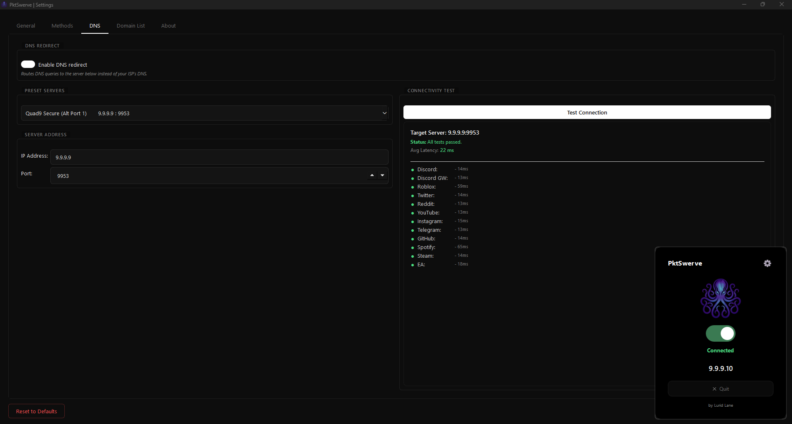

# PktSwerve

A lightweight DPI (Deep Packet Inspection) bypass tool for Windows that circumvents network-level content filtering and blocking. Built with C++ and Qt, PktSwerve uses kernel-level packet manipulation via WinDivert with selective domain support for precise control over which traffic receives DPI evasion.

**Official Website**: [luridlane.com](https://luridlane.com)

## Screenshots

### Main Interface


## Features

- **DPI Bypass**: Circumvent Deep Packet Inspection filtering at the network level
- **Domain Selective**: Apply bypass techniques only to specified domains while leaving others unaffected
- **Lightweight**: Minimal resource consumption (approximately 10 MB RAM, negligible CPU usage)
- **Kernel-Level Packet Manipulation**: Direct packet interception via WinDivert driver
- **Simple Interface**: Intuitive user interface requiring only a single action to activate bypass
- **Local Processing**: All operations performed locally on your machine with no external traffic routing

## Platform Support

### Currently Supported
- **Windows 11**: Full support with complete feature set (v1.0 tested)
- **Windows 10**: Likely compatible, not yet tested in v1.0

### Upcoming Support
- **macOS**: Planned for future release
- **Linux**: Planned for future release
- **Android**: Planned for future release

## System Requirements

### Windows
- Windows 10 or Windows 11
- Administrator privileges required
- 10 MB RAM minimum
- WinDivert driver (included)

## Installation

### Windows

1. Download the latest release from the [releases page](https://github.com/luridlane-dev/PktSwerve/releases)
2. Extract the archive to your desired location
3. Run `PktSwerve.exe` with administrator privileges
4. No additional installation or driver installation required

## Usage

### Basic Operation

1. Launch `PktSwerve.exe` with administrator privileges
2. (Optional) Configure target domains in the **Domain List** tab for selective filtering
3. Click the **Connect** button to activate DPI bypass
4. Click **Disconnect** to deactivate

The application will save your configuration automatically.

### Configuration Tabs

#### General
Main settings and connection controls for DPI bypass activation.

#### Methods
Configure packet fragmentation and deception techniques:
- **HTTPS/TLS ClientHello Fragmentation**: Splits TLS handshake packets to prevent SNI (Server Name Indication) detection in a single packet
- **HTTP Fragmentation**: Fragments plaintext HTTP requests on port 80
- **Fragmentation Options**: Customize fragment size (default: 2 bytes) and send order
- **Deception Packets**: Deploy fake packets with manipulated TTL or checksums to confuse DPI systems

#### DNS
Configure DNS redirect settings to bypass DNS-based filtering:
- **Enable DNS Redirect**: Route DNS queries through custom DNS servers instead of ISP defaults
- **Preset Servers**: Pre-configured providers including Quad9 Secure and other public DNS services
- **Custom Servers**: Specify custom DNS server IP address and port
- **Connectivity Test**: Verify connection to selected DNS server with latency measurement

#### Domain List
Specify which domains should receive DPI bypass treatment. Leave empty to apply bypass globally to all domains.

### Configuration Storage

Configuration is automatically saved to:
```
C:\Users\[YourUsername]\AppData\Local\LuridLane\PktSwerve\config.json
```

You can manually edit this JSON file or use the GUI to manage settings.

## How It Works

PktSwerve operates at the kernel level using WinDivert to intercept and manipulate network packets. It employs multiple DPI evasion techniques:

### Packet Fragmentation
Splits packets at the TLS handshake or HTTP layer to prevent DPI systems from detecting the target domain in a single packet. The SNI (Server Name Indication) field in TLS ClientHello can be fragmented across multiple packets, making it invisible to stateless packet inspection.

### Deception Techniques
Sends carefully crafted fake packets with:
- **Low TTL values**: Packets that expire before reaching the actual server but are processed by DPI systems, confusing their state tracking
- **Invalid TCP checksums**: Manipulated checksums that cause DPI systems to drop or ignore packets while valid packets bypass the check
- **Incorrect sequence numbers**: Disrupts TCP stream reassembly in DPI systems

### DNS Redirection
Routes DNS queries through alternative DNS servers that do not implement the same filtering rules as the ISP's default DNS resolver.

### Domain Selective Bypass
When domains are specified in the Domain List, only traffic to those domains receives DPI evasion treatment. Other traffic passes through normally without modification.

## Technology Stack

- **Language**: C++
- **GUI Framework**: Qt
- **Packet Manipulation**: WinDivert
- **Platform**: Windows (kernel-mode driver interface)

## Building from Source

### Requirements
- Qt 5.x or later
- WinDivert development files
- C++ 17 or later

### Build Instructions

1. Clone the repository:
```bash
git clone https://github.com/luridlane-dev/PktSwerve.git
cd PktSwerve
```

2. Open the Qt project file or Visual Studio solution
3. Configure Qt paths and WinDivert include/lib paths
4. Build the project in Release mode
5. The compiled `PktSwerve.exe` will be in the build output directory

## Configuration Examples

### Bypass Specific Domains Only

1. Launch PktSwerve with administrator privileges
2. Go to the **Domain List** tab
3. Add the domains you want to bypass (one per line)
4. Configure DPI evasion methods in the **Methods** tab as needed
5. Click **Connect**

Example domains:
```
example.com
subdomain.example.org
restricted-site.net
```

### Custom DNS Server

1. Go to the **DNS** tab
2. Enable "Enable DNS redirect"
3. Enter custom DNS server IP (e.g., `8.8.8.8`) and port (e.g., `53`)
4. Click "Test Connection" to verify connectivity
5. Click **Apply** and **Save**

## Advanced Options

- **HTTP Fragment Size**: Adjust fragment size in bytes (default: 2) for optimal bypass effectiveness. Smaller values may be more effective but slower.
- **HTTPS Fragment Size**: Customize TLS packet fragmentation (default: 2 bytes)
- **Fake Packet TTL**: Control the lifetime of decoy packets (default: 8 hops)
- **Send Fragments in Reverse Order**: Sends fragment 2 before fragment 1 to further confuse inspection systems

## Performance Characteristics

PktSwerve is designed to have minimal system impact:

- **Memory Usage**: Approximately 10 MB RAM
- **CPU Usage**: Negligible (typically <1% during operation)
- **Network Latency**: Minimal additional latency depending on configuration
- **Throughput**: No significant impact on connection speed

## Privacy and Security

- **Local Processing**: All packet manipulation occurs locally on your machine
- **No External Routing**: Traffic is not routed through external servers or proxies
- **No Traffic Logging**: PktSwerve does not log, analyze, or store network traffic
- **DPI Bypass Only**: This tool modifies packets to evade DPI inspection; it does not encrypt traffic or provide anonymity beyond DPI evasion

For encryption and anonymity, use PktSwerve in combination with a VPN or proxy service.

## Troubleshooting

### PktSwerve requires administrator privileges
Run the application with administrator rights. Right-click `PktSwerve.exe` and select "Run as administrator". Administrator privileges are required to access kernel-mode packet drivers.

### Connection test fails in DNS tab
Verify that:
- The target DNS server IP address and port are correct
- Network connectivity to the DNS server is available
- No firewall or ISP is blocking DNS queries to that server
- Port 53 (default DNS port) is not blocked

### Bypass not working effectively
- Ensure correct domains are added to the Domain List (if using selective mode)
- Verify appropriate DPI evasion methods are enabled in the Methods tab
- Experiment with different fragment sizes and deception techniques
- Some DPI systems may require multiple evasion methods in combination
- Network conditions and ISP DPI implementation vary; results are not guaranteed

### Application crashes on startup
- Ensure you are running Windows 10 or Windows 11
- Run with administrator privileges
- Verify that WinDivert driver can be loaded (may require driver signature enforcement settings to be adjusted)
- Check that no conflicting packet filtering software (like some VPNs) is installed

## Known Limitations

- Windows only in v1.0 (macOS, Linux, Android support planned)
- WinDivert requires Windows driver support
- Some advanced DPI systems may implement additional detection methods
- Results depend on specific ISP/network DPI configuration

## Contributing

Contributions are welcome. Please submit pull requests with improvements, bug fixes, or platform-specific implementations (macOS, Linux, Android).

## License

This project is licensed under the GNU General Public License v3.0 - see the [LICENSE](LICENSE) file for details.

## Disclaimer

**Important**: PktSwerve is provided for educational, research, and legitimate circumvention of censorship purposes. Users are entirely responsible for ensuring their usage complies with applicable laws and regulations in their jurisdiction.

- Unauthorized network access is illegal in most jurisdictions
- Some networks explicitly prohibit DPI bypass tools
- This tool does not provide legal protection or anonymity
- Use at your own risk and with appropriate legal consideration

The creators and maintainers of PktSwerve assume no liability for misuse or damages resulting from this software.

## Support

For issues, feature requests, bug reports, or questions, please open an issue on the [GitHub repository](https://github.com/luridlane-dev/PktSwerve/issues).

Visit [luridlane.com](https://luridlane.com) for additional information.
